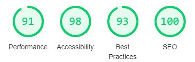

# Penny for your Thoughts


**[Live site](https://edb83.github.io/penny-for-your-thoughts/)**

---

<span id="top"></span>

## Index

- <a href="#context">Context</a>
- <a href="#ux">UX</a>
  - <a href="#ux-stories">User stories</a>
  - <a href="#ux-wireframes">Wireframes</a>
  - <a href="#ux-theme">Theme</a>
- <a href="#features">Features</a>
  - <a href="#features-all">Site wide</a>
  - <a href="#features-pages">Pages</a>
  - <a href="#features-future">Still to implement</a>
- <a href="#technologies">Technologies Used</a>
- <a href="#testing">Testing</a>
  - <a href="#testing-auto">Automated</a>
  - <a href="#testing-manual">Manual</a>
  - <a href="#testing-responsive">Responsiveness</a>
  - <a href="#testing-resolved">Resolved issues</a>
  - <a href="#testing-unresolved">Unresolved issues</a>
  - <a href="#testing-bugs">Known bugs</a>
- <a href="#deployment">Deployment</a>
- <a href="#credits">Credits</a>

---

<span id="context"></span>

## Context

This site is a showcase for an aspiring photographer's work, which is available to purchase either on card or enlarged print.

Since moving to the countryside, Penny has found herself increasingly inspired by her beautiful surroundings and is keen to share them with a wider audience. More than ever in these uncertain, digital times, there's comfort to be found in a personal message written on a physical card, adorned with beautiful, candid pictures of nature.

<div align="right"><a style="text-align:right" href="#top">Go to index :arrow_double_up:</a></div>
<span id="ux"></span>

## UX

### Overview

The site is aimed at people looking for greeting cards, specifically those who value supporting local endeavours rather than large, established corporations. The site’s intended audience are people who value the personal touch and ability to communicate directly with the seller.

The enterprise is humble but, as evidenced by the quality of the pictures, has a wealth of emotive images from the English countryside to share. These are the scenes we may all have witnessed but which are seldom captured.

<span id="ux-stories"></span>

### User stories

For ease of reference, the means by which a user's expectations have been met are summarised in the tables below:

| As a **client** I want                                                                                                                                    | How this is achieved                                                                                                                                                                                                                                                                                                                                                                                                                                                                                                                                                    |
| :-------------------------------------------------------------------------------------------------------------------------------------------------------- | :---------------------------------------------------------------------------------------------------------------------------------------------------------------------------------------------------------------------------------------------------------------------------------------------------------------------------------------------------------------------------------------------------------------------------------------------------------------------------------------------------------------------------------------------------------------------- |
| Visitors to be immediately aware of what the product is                                                                                                   | The sub-heading over the hero image, call to action (Purchase button) and the three introductory statements make it immediately clear what the product is                                                                                                                                                                                                                                                                                                                                                                                                               |
| A clean, consistent interface which will not confuse visitors                                                                                             | The navbar, footer and headings of each page are clear, simple and consistent, as are the spacing, typography, image styling and colours. All clickable links have consistent visual feedback, including the subtle hover effect on the intro gallery images                                                                                                                                                                                                                                                                                                            |
| My work to be showcased from the outset, with a gallery allowing visitors to quickly browse through high quality images and add them to a shopping basket | The landing page is dedicated to a full-viewport hero image and samples of the various themes of image below it, ensuring the photographer's work is centre stage. <br>The gallery is accessible via the nav bar, call to action and intro gallery images. It benefits from a clean, effective modal which displays Full HD images in their original aspect ratio, and allows the entire gallery to be browsed with just the mouse wheel / swiping. There is an "Add (to basket)" button on each image for a shopping experience matching typical browsing expectations |

| As a **visitor** I want                                                                                                                                                               | How this is achieved                                                                                                                                                                                                                                                                                                                                 |
| :------------------------------------------------------------------------------------------------------------------------------------------------------------------------------------ | :--------------------------------------------------------------------------------------------------------------------------------------------------------------------------------------------------------------------------------------------------------------------------------------------------------------------------------------------------- |
| For it to be immediately clear what the purpose of the site is and what it has to offer. The interface and layout should be clean, with a focus on showcasing the images for purchase | Aligns with client's expectations                                                                                                                                                                                                                                                                                                                    |
| To learn something about the photographer and to be able to contact them directly or find them on social media                                                                        | The About page is separate from the rest of the content but is easily accessible for those wishing to learn more about the photographer, and the information itself is not overly dense or excessive. The About page includes a contact email and the minimalist footer provides available social media links, as is expected by all web users today |
| To be able to quickly find out more about the product, specifically its price and available options                                                                                   | The Pricing page is currently separate and provides an acceptible means of sharing this information, which is laid out in a pair of easily digestible tables containly only pertinent information. As the project develops and the shopping basket is implemented, this information may be conveyed more effectively elsewhere                       |
| Quick access to the gallery, with the option to sort by theme                                                                                                                         | Currently this expectation is met (and promoted) using the nav bar Gallery dropdown list and intro gallery below the hero image. This method will be re-examined as new images are added and when future functionality enables advanced search options                                                                                               |
| To be able to sign up for more information and updates on the photographer’s work                                                                                                     | The Sign Up page has the singular purpose of establishing a connection with potential clients in the hope of securing repeat business                                                                                                                                                                                                                |
| To be able to access all information on a range of devices                                                                                                                            | Addressed in the <a href="#testing-responsive">Responsiveness</a> section below                                                                                                                                                                                                                                                                      |
| Images to be fast to load and easy to navigate                                                                                                                                        | Efforts have been made to reduce the size of files to what is acceptible on the web today, but there is scope to utilise thumbnails of an even smaller size to improve the speed at which the Gallery loads                                                                                                                                          |

Seven individuals contributed to testing the site and provided feedback on its layout, responsiveness and styling at various points in development.

<span id="ux-wireframes"></span>

### Wireframes

Overall the wireframes were successfully converted into a functioning website, however there were some deviations from the plan. These were:

1. A circular image divided up into four seasons (with the same functionality as the intro gallery images on the landing page) was originally envisaged, however it was not possible to create this to the desired standard in the time available, so the idea was dropped. Furthermore, the page structure required would have been unnecessarily complex and ultimately misleading and repetitive.
2. The option to Sign In was planned to appear below the Sign Up form, however as the project advanced it became apparent that this was not a needed feature in this first iteration. The decision was made to simplify the design and stick to the core requirement of providing a means to subscribe to information rather than to log in with no purpose. The benefits of signing into the site are more closely tied to the (as yet) unrealised shopping basket feature and will be explored in future.

The full suite of wireframes for **desktop**, **tablet** and **mobile** devices, plus a **sitemap**, can be accessed [here](wireframes/).

### Site theme

Based on the client's brief and visitors' expectations for the site, a clean, simple aesthetic has been adopted. In previous iterations the theme was more minimalistic in an attempt to focus purely on the content, but this was counterintuitive as the lack of contrast reduced the visibility of important elements and overall the site lacked identity.

Two fonts with a soft, warm style have been used across the site: [Montserrat](https://fonts.google.com/specimen/Montserrat) and [Open Sans](https://fonts.google.com/specimen/Open+Sans).

At this point, user feedback suggested changing the hero image and after doing so, [Color Scheme Designer](https://colorschemedesigner.com/csd-3.5/) was used to pull out several complimentary and web-friendly colours (#036, #39C, #960) which tied in with the new hero image. The result is a much more vibrant aesthetic based on blues and gold, which gives the site a bolder appearance and more character. Furthermore, visual feedback for user actions became much clearer and the identity of separate elements (e.g images with shadows, golden horizontal rules to indicate consitent headings etc) became more apparent. At a late stage in development the Pricing tables were given a border shadow consistent with the rest of the site, as feedback suggested the Pricing page was the weakest page, aesthetically.

<div align="right"><a style="text-align:right" href="#top">Go to index :arrow_double_up:</a></div>

<span id="features"></span>

## Features

<span id="features-all"></span>

### Site-wide

**1. Navbar**

- Collapses into a hamburger icon to support the mobile browsing experience
- Brand maintains visibility on all device sizes
- Brand acts as the Home button to avoid duplication and clutter
- Drop down options are scrollable on mobile devices in landscape orientation to prevent frustrating case of hidden options
- High contrast hoverable links provide responsive visual feedback
- Active links clearly indicate current location on site
- Shopping basket for quick access to purchasing selected items (for future implementation and currently disabled)

**2. Footer**

- Social media links with a blank target to prevent disruption to the browsing experience
- Copyright
- Footer is always positioned at the bottom of the page for consistency and visual appeal (primarily for larger displays where content would otherwise not fill the viewport)

<span id="features-pages"></span>

### Pages

**3. Landing page**

- Full viewport hero image to showcase the photographer's imagery (primary goal) and promote the site's colour scheme
- Transparent jumbotron to emphasise the name of the site
- Call to action button linking to the gallery and inviting to purchase (primary goal)
- Succinct and clear introduction outlining the purpose of the site
- Mini gallery showcasing the different themes of images, including links for quick access to the respective sections of the full gallery as well as responsive visual feedback

**4. About**

- Provides the voice of the photographer, plus their background, credentials and reason for setting up the site
- Link to email photographer directly with email subject placeholder to encourage completion

**5. Pricing**

- Brief description of product
- Two clear tables with prices for both cards and prints, including price per unit for multiple orders and statement that postage not included

**6. Gallery**

- Brief introduction explaining how to add items to basket and how to view in full aspect ratio
- Six themed sections (Canals, Coast, Flora and Fauna, Flowers, Landscapes, Trees)
- On mobile, images are clearly displayed in their original aspect ratio, while on larger devices they are displayed uniformly cropped and in a responsive grid for easy browsing
- Clear 'Add (to basket)' button in consistent position on all images. Enables users to add an item to shopping cart (with just two clicks from the landing page) and includes visual feedback on hover
- Ability to enlarge images by clicking on them, and to scroll through a pop-up gallery of images in full aspect ratio. Clicking outside viewing area (or swiping up/down on mobile) returns visitor to the normal gallery
- Within pop-up gallery, user can view thumbnails of all images and use the mouse wheel or swipe to scroll through
- Names of each image are included at bottom of pop-up gallery, providing some context for each scene and enabling visitors to ask specific questions of the photographer
- Image sizes are all below 300kb for faster loading, while preserving FHD resolution to showcase their quality

**7. Signup**

- Simple form allows the user to sign up for more information and news of fresh images being added to gallery
- Validation of user inputs (blank fields, typical email format), indicating any errors clearly

<span id="features-future"></span>

### Features left to implement

- Shopping basket and purchasing functions

  _This crucial missing feature will include payment options (multiple item purchase, choice of size), purchase history and the option to save delivery address and card details for repeat purchases_

- Ability to search for specific images / metadata

  _e.g results for ‘deer’, ‘butterfly’, ‘water’, ‘water’, ‘sunset’, ‘rocks’, ‘tractor’_

- Additional browsing criteria

  _e.g seasons, landscape / portrait_

- Mock-up of image for chosen options

  _e.g 'Show me what Twisted Tree looks like on a card / in large print'_

- Option to order cards with a choice of messages / bespoke messages

- Improved form validation

<div align="right"><a style="text-align:right" href="#top">Go to index :arrow_double_up:</a></div>

<span id="technologies"></span>

## Technologies Used

### Languages

- HTML
- CSS
- Javascript
  - [Fancybox](https://fancyapps.com/fancybox/3/) - modal gallery
  - [jQuery](https://jquery.com/) - collapsable nav bar
  - [popper.js](https://popper.js.org/) - collapsable nav bar

### Project management

- [Balsamiq](https://balsamiq.com/wireframes/) - Wireframe creation tool
- [GitHub](https://github.com/) - Version control and deployment
- [GitPod](https://gitpod.io/) - IDE used to code the site

### Style and theme

- [Autoprefixer](https://autoprefixer.github.io/) - Post CSS plugin which parses CSS and adds vendor prefixes
- [Bootstrap](https://getbootstrap.com/) - Responsive grid and boilerplate styling framework
- [Color Scheme Designer](https://colorschemedesigner.com/csd-3.5/) - Complimentary color scheme for the site
- [CSS Tricks](https://css-tricks.com/examples/hrs/) - Specifically for linear-gradiant horizontal rule
- [Font Awesome](https://fontawesome.com/) - Icon used for shopping cart in navbar
- [Free Formatter](https://www.freeformatter.com/html-formatter.html) - Formatting HTML code
- [Google Fonts](https://fonts.google.com/) - Open Sans and Monserrat fonts
- [Zyro Logo Maker](https://zyro.com/logo-maker) - Creating the favicon

### Visual effects

- [Hover.css](https://ianlunn.github.io/Hover/) - Effect applied to intro gallery circular previews

### Image manipulation

- [IrfanView](https://www.irfanview.com/) - Program for cropping image batches to the same aspect ratio
- [Tiny JPG](https://tinyjpg.com/) - Reducing the size of all images without noticeable loss of quality

### Online resources

- [How to Geek](https://www.howtogeek.com/354015/how-to-resize-images-and-photos-in-windows/) - specifically advice on how to efficiently handle a large number of images
- [PX-to-REM Calculator](https://daniellamb.com/experiments/px-to-rem-calc/)
- [Stack Overflow](https://stackoverflow.com/)
- [W3 Schools](https://www.w3schools.com/)

<div align="right"><a style="text-align:right" href="#top">Go to index :arrow_double_up:</a></div>

<span id="testing"></span>

## Testing

<span id="testing-auto"></span>

### Automated testing

- [Chrome DevTools](https://developers.google.com/web/tools/chrome-devtools) - ran an audit on all pages for both desktop and mobile.

Summary:

- Performance = **Average**
  - The worst metric due to issues around image size and not using next-gen filetypes, particularly on gallery.html where the score was 74% on mobile - it is beyond the scope of this project to address this
  - Unused CSS - removed hover.min.css from all but index.html where it is used on the intro gallery images
- Accessibility = **Good**
  - Various links missing discernable names (mainly nav bar and footer) - fixed by adding aria labels to all links across the site
  - Insufficient contrast ratio on hero image and nav bar Brand
  - Lowest score 96% on desktop following amendments
- Best Practices = **Good**
  - Front-end Javascript libraries with known security vulnerabilities (Bootstrap and jQuery) - it is beyond the scope of this project to address this
- SEO = **Good**
  - `head` was missing `<meta name="description" content="..." />` - fixed
  - Scores 95% on Gallery due to 'Add' button being smaller than 48px x 48px. Tested with larger button sizes but they took up too much real estate - it is beyond the scope of this project to address this
  - Scores 100% across all other pages following amendments

Mobile scores:

- Home



- About


- Pricing


- Gallery


- Sign Up


- [W3C - HTML](https://validator.w3.org/) - On update no HTML errors or warnings detected - **PASS**
  - `alt` tags missing
  - call to action `button` with `type="button"` identified as an issue
  - `section` without heading element
- [W3C - CSS](https://jigsaw.w3.org/css-validator/) - no CSS errors detected - **PASS**
  - Update: passing CSS code through [Autoprefixer](https://autoprefixer.github.io/) produced 47 warnings related to unknown vendor extensions
- [Unicorn revealer - overflow](https://chrome.google.com/webstore/detail/unicorn-revealer/lmlkphhdlngaicolpmaakfmhplagoaln/related) - tested all pages and no evidence of overflow - **PASS**

<span id="testing-manual"></span>

### Manual testing

**Summary**:

Of the manual tests conducted, the only ones to fail were those related to default form validation settings. These test were initially carried out on a boilerplate Bootstrap form and subsequently using the `novalidate` JS method described in Bootstrap, but the results were the same. Research shows that the `pattern` property could address this, but has stated by [Mozilla](https://developer.mozilla.org/en-US/docs/Web/HTML/Element/input/email#Validation): "HTML form validation is not a substitute for scripts that ensure that the entered data is in the proper format". Solving this is beyond the scope of the project.

The following scenarios were tested to ensure that the site is functioning as expected:

**1. Nav bar**

- From each page
  - check that nav bar links take you to the correct page - **PASS**
  - check that each Gallery dropdown link takes you to the correct section of the Gallery page - **PASS**
  - check that nav bar links (including Brand) have the correct styling (blue) when hovered over on desktop devices - **PASS**
  - check that the active / current nav bar link (excluding Brand) is correctly styled and distinguished from the others - **PASS**

**2. Footer**

- From each page
  - check that all social media links take you to the relevant external site, and open in a separate browser tab - **PASS**
  - check that all social media icons have the correct styling (dark yellow) when hovered over on desktop devices - **PASS**

**3. Landing page**

- Click the Purchase button to check it goes to the top of the Gallery page - **PASS**
- On desktop, hover over the Purchase button to check visual feedback is provided (white background, black text) - **PASS**
- Click each intro gallery circular image to check it takes you to the relevant anchor within the Gallery page - **PASS**
- On desktop, hover over each intro gallery circular image to check visual feedback is provided (hvr-grow effect) - **PASS**

**4. About page**

- Click the "Contact me" email link to check it creates a new email to the photographer - **PASS**
- Check the Subject of the new email message is correctly filled - **PASS**

_Note: initially a missing ">" was preventing the Subject field being filled but this was corrected_

**5. Pricing page**

- No functionality to test - **N/A**

**6. Gallery page**

- Click each of the 48 images to check it brings up a modal with the correct image enlarged - **PASS**

_Note: initially some file names were incorrect but were all amended_

- Check that the correct caption is displayed for each of the 48 images in the modal gallery - **PASS**
- Check that all 48 "Add" buttons (currently no functionality as shopping basket is beyond scope of project, see Features left to implement) have the correct styling (dark blue) when hovered over on desktop devices - **PASS**

**7. Signup**

- On desktop, hover over the Sign Up button to check visual feedback is provided (dark blue) - **PASS**
- On sign-up form

  - leave all fields blank and click Sign Up button to check validation displays an input issue - **PASS**
  - enter all fields correctly and click Sign Up button to check validation confirms correct inputs - **PASS**
  - enter all fields correctly apart from one (in turn) and check validation correctly identifies issues - **PASS**
  - enter an email address in an incorrect format to check validation displays an input issue. Results:

  |  Entry  | Test result |
  | :-----: | :---------: |
  |   `@`   |  **PASS**   |
  |  `_@_`  |  **PASS**   |
  |  `a@b`  |  **FAIL**   |
  | `a_@_b` |  **PASS**   |
  | `a@_b`  |  **PASS**   |
  | `a_@b`  |  **PASS**   |

  - enter something different for Password and Confirm Password to check validation displays an input issue - **FAIL**
  - enter a space (" ") as either password to check validation displays an input issue - **FAIL**

<span id="testing-responsive"></span>

### Responsiveness

The site has been designed with a mobile-first philosophy and, supported by [Bootstrap](https://getbootstrap.com/), has been thoroughly tested at all stages of development using [Chrome DevTools](https://developers.google.com/web/tools/chrome-devtools). In addition to Bootstrap's breakpoints, various media queries have been used to maximise the legibility of text and provide sufficient spacing for all contents. These queries include altered `font-size`, `height`, `margin`, `max-height`, `max-width`, `padding`, `text-align` and `width`.

The following issues arose and have each been addressed:

| Issue                                                                                                                  | Solution                                                                                                                |
| :------------------------------------------------------------------------------------------------------------------------------------ | :---------------------------------------------------------------------------------------------------------------------- |
| Navbar Brand causes hamburger icon to spill                                                                                           | Reduced starting `font-size`, removed `margin-right`and added media query to increase above `min-width: 370px`          |
| Navbar dropdown not visible on landscape mobile devices                                                                               | Added media query to set `overflow-y: scroll`. See Issues and resolutions section below                                 |
| Footer social media icons appear cramped on larger displays                                                                           | Added media query to increase `margin: 0 1rem;`                                                                         |
| Landing page main heading ran to several lines on smaller displays                                                                    | Reduced starting `font-size` of callout header and paragraph and added media query to increase above `min-width: 768px` |
| Pricing tables appear too elongated on larger displays when filling two columns                                                       | Added two media queries to increase `padding` above above `min-width: 768px` and `min-width: 992px`                     |
| Image of photographer in About suffered from unwanted top margin (which was needed in single-column views) when sharing row with text | Added media query to remove `margin-top` of the container and change `max-height` and `max-width` of the image          |
| Gallery images on small displays appear too wide                                                                                      | See Issues and resolutions below                                                                                        |

#### Browsers

Tested on:

- Chrome
- Edge
- Firefox
- Safari (iOS)
  - NB issue with styles being overwritten on call to action (Purchase button on landing page). See <a href="#testing-resolved">Resolved issues</a> below

#### Screen sizes

Tested with Chrome DevTools using profiles for:

- Moto G4
- Galaxy S5
- Pixel 2
- Pixel 2 XL
- iPhone 5 SE
- iPhone 6/7/8
- iPhone 6/7/8 Plus
- iPhone X
- iPad
- iPad Pro

... and also using the responsive profiles of:

- Mobile S (320px)
- Mobile M (375px)
- Mobile L (425px)
- Tablet (768px)
- Laptop (1024px)
- Laptop L (1440px)

Real world testing on:

- iPhone 6S
- iPhone 11 Pro
- Asus ZenBook

### Issues and resolutions

<span id="testing-resolved"></span>

#### Resolved

- **Hero image does not display on iOS mobile devices**

  - Resolved by adding a media query for smaller displays which sets `background-attachment: scroll`

- **Navbar does not collapse when clicking links within the same page**

  _When the Gallery or hamburger dropdowns are expanded in the navbar, anchor links within the same page will not collapse the navbar (most noticeable on the Gallery page)_

  - Resolved by customising a Javascript snippet from [Stack Overflow: How to hide a collapsible Bootstrap 4 navbar on click](https://stackoverflow.com/questions/42401606/how-to-hide-collapsible-bootstrap-4-navbar-on-click) to point to the relevant classes in the navbar

- **Navbar dropdown not visible on landscape mobile devices**

  _When expanding the Gallery nav-item in the navbar while in landscape mode on a mobile device, not all list items are visible and cannot be clicked_

  - Resolved by using a suggestion found on [Github: Cannot scroll down a collapsed navbar on mobile devices](https://github.com/twbs/bootstrap/issues/23374) and adding a media query for smaller displays which sets `overflow-y: scroll` and `height: 115px` to ensure the list items are visible on all displays

- **Intro gallery circular images on right margin cause overflow when hvr-grow effect is appled**

  - Resolved by incrementally reducing the width of intro-gallery and finally settling on `width: 91%`

- **iOS browser adds unwanted styling to Pricing button in hero image**

  - Resolved by using code from [Dare to Think: Stop iOS styling your input fields and buttons](https://www.daretothink.co.uk/stop-ios-styling-your-input-fields-and-buttons/) to target `input[type="button"]` and override using `-webkit-appearance: none`

- **Links on social media icons in footer apply to the entire containing div**

  - Resolved by switching to an `inline-flex` list and adding class `sm-list` to `a` elements. Subsequently recognised that playing with margins bypasses this issue when compared with padding, however overall the approach is now more flexible. Further issues arose relating to spacing of the icons so it was necessary to include media queries to increase the starting value of `margin: 0 1rem`

- **Links / hover effects on intro gallery circular images apply to the entire containing div**

  - Resolved using suggestion from [Stack Overflow: Only make a centered-image a link instead of the whole parent div](https://stackoverflow.com/questions/29978500/only-make-a-centered-image-a-link-instead-of-the-whole-parent-div) moving size styling from the image to the `<a>` element within a newly created container class `.intro-gallery-image` and then adding `display: flex`

- **Use of horizontal rules (`<hr>`) considered poor practice and outdated**

  - Resolved using suggestion from [Stack Overflow: Can we set a gradient color to border-bottom property?](https://stackoverflow.com/questions/23751274/can-we-set-a-gradient-color-to-border-bottom-property) and switching to styling headings with `background: linear-gradient`

- **There is white space beneath footer on pages with little content (Pricing and About)**

  - Resolved by using a suggestion from [Philip Walton: Sticky footer](https://philipwalton.github.io/solved-by-flexbox/demos/sticky-footer/) to set body element `flex-direction: column` and `min-height: 100vh`. This was a more elegant solution than changing the structure of the site e.g. by adding the Pricing and About pages further down the Landing Page and relying on achor links, or by simply increasing the content on each of the affected pages

- **Gallery image buttons do not stay inside their respective images where images have different aspect ratios**

  _Due to having_ `position: abolute` _buttons were left floating outside of their images_

  - Initially resolved by fixing the height of images to `vh20` but this had the unintended side-effect of making them appear too wide on mobile devices

- **Gallery images on small displays appear too wide**

  - Resolved by giving the image `height: 200px` and adding a media query which changes this to `height: 100%` on smaller devices. This has the added benefit of displaying images in their original aspect ratio on mobile

- **Signup form validation messages display poorly on iOS**

  _Despite displaying correctly in Chrome devtools, the display on iOS leaves validation error messages appearing clipped and ugly_

  - Resolved by using Bootstrap's recommended `needs-validation` class and `novalidate` ([Source](https://getbootstrap.com/docs/4.1/components/forms/#custom-styles)). A block styled with `invalid-feedback` was avoided to prevent error messages appearing and shifting the lines of input fields

<span id="testing-unresolved"></span>

#### Unresolved

- **Signup form password and confirmation password can be different**

  - This needs to be resolved but is not sufficiently problematic with regards to its intended purpose and is outside the scope of its project. A solution will need to be found when implementing payment options in a future iteration

<span id="testing-bugs"></span>

### Known bugs

- None at present

<div align="right"><a style="text-align:right" href="#top">Go to index :arrow_double_up:</a></div>

<span id="deployment"></span>

## Deployment

There is just one branch of this project (master) and the deployed version of this site is the most current version in the repository.

### How to deploy

To deploy this page to GitHub Pages from its [GitHub repository](https://github.com/Edb83/penny-for-your-thoughts), the following steps were taken:

1. From the menu items near the top of the page, select **Settings**
2. Scroll down to the **GitHub Pages** section
3. Under **Source** click the drop-down menu labelled **None** and select **Master Branch**
4. On selecting Master Branch the page will be automatically refreshed and the website is now deployed
5. Scroll back down to the **GitHub Pages** section in **Settings** to retrieve the link to the deployed website. It may take a short time to go live, but typically less than 60 seconds

### How to run locally

To clone this project from GitHub:

1. Under the repository name, click "Clone or download"
2. In the Clone with HTTPs section, copy the clone URL for the repository
3. In your local IDE open Git Bash
4. Change the current working directory to the location where you want the cloned directory to be made
5. Type `git clone`, and then paste the URL you copied in Step 2

```console
git clone https://github.com/Edb83/penny-for-your-thoughts.git
```

6. Press Enter. Your local clone will be created

Further reading and troubleshooting on cloning a repository from GitHub can be found [here](https://help.github.com/en/articles/cloning-a-repository).

<div align="right"><a style="text-align:right" href="#top">Go to index :arrow_double_up:</a></div>

<span id="credits"></span>

## Credits

Code was either directly copied or modified from the following sources:

- [Bootstrap: Custom form styles](https://getbootstrap.com/docs/4.1/components/forms/#custom-styles)
- [Dare to Think: Stop iOS styling your input fields and buttons](https://www.daretothink.co.uk/stop-ios-styling-your-input-fields-and-buttons/)
- [Github: Cannot scroll down a collapsed navbar on mobile devices](https://github.com/twbs/bootstrap/issues/23374)
- [Philip Walton: Sticky footer](https://philipwalton.github.io/solved-by-flexbox/demos/sticky-footer/)
- [Stack Overflow: Can we set a gradient color to border-bottom property?](https://stackoverflow.com/questions/23751274/can-we-set-a-gradient-color-to-border-bottom-property)
- [Stack Overflow: How to hide a collapsible Bootstrap 4 navbar on click](https://stackoverflow.com/questions/42401606/how-to-hide-collapsible-bootstrap-4-navbar-on-click)
- [Stack Overflow: Only make a centered-image a link instead of the whole parent div](https://stackoverflow.com/questions/29978500/only-make-a-centered-image-a-link-instead-of-the-whole-parent-div)

### Content

The text in the About page and beautiful photos used throughout this site were obtained from Penny Holland, with permission granted to use them. All other text was written by me and agreed with Penny.

The Deployment section was copied from Richard Wells' README ([Source](https://github.com/D0nni387/Luxury-Door-Solutions/blob/master/README.md))

### Acknowledgements

- Carlos R (Code Institute Slack Community Lead) - for his general help and pointers on CSS autoprefixing

- Chris Palmer (Code Institute student) - for his detailed peer review and pointed UX suggestions

- Jonathan Munz (Code Institute Mentor) - for his sage advice, prompts to find solutions, and calm reassurances during the project

- Richard Wells (Code Institute Slack Lead) - for his webinar on writing the README and Chrome DevTools 

- The Code Institute Slack Community - for many tips and tricks discovered while browsing

- Lola, Tash, Mims, Beckx and Peter - for their unfiltered feedback on overall appearance and responsiveness

### Disclaimer

This site was developed for educational purposes but will likely be put to real world use once the remaining features have been implemented according to client's wishes.

<div align="right"><a style="text-align:right" href="#top">Go to index :arrow_double_up:</a></div>
